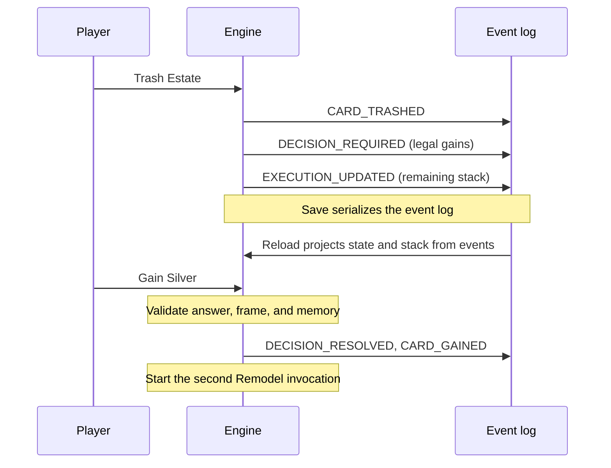
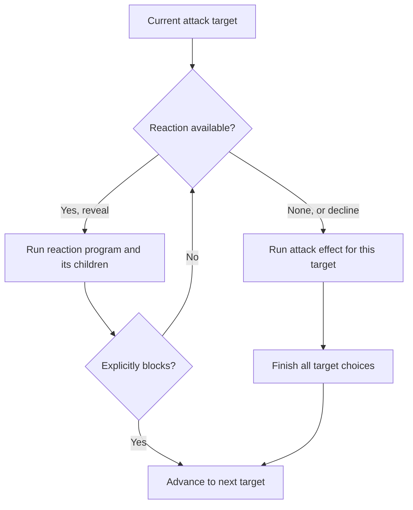

# How the engine works

The stack is a saved to-do list. The runner takes the last entry, runs it, and
keeps going until a player must answer or the list is empty.

Commands validate player intent. Each card exposes one `run(context, input)`
[program](../cards/program.ts) and a schema for its saved local memory. A step returns one of:

- `done(events)` — finish this invocation.
- `choose(request, memory, events)` — ask a player, then resume with their answer.
- `schedule(operations, events, continuation?)` — finish child work in order,
  then optionally resume this invocation with the saved continuation.

[The runner](execute.ts) owns the stack, event IDs, intermediate state projection, reaction
windows, and checkpoints. Frames are serializable data. A nested choice finishes
before its caller resumes; repeating a play moves one physical card and invokes
its effect multiple times. Cards never read a pending UI choice to recover their
execution state.

## Walkthrough: Throne Room plays Remodel twice

Suppose your hand contains Throne Room, Remodel, Estate, and Silver. You choose
Remodel with Throne Room. With normal costs, this is one possible execution:

```text
Throne Room
└── play Remodel from hand, times: 2       ← move the physical card once
    ├── first Remodel invocation
    │   ├── ask which card to trash       → Estate
    │   └── ask which card to gain        → Silver (up to $4)
    └── second Remodel invocation
        ├── ask which card to trash       → original Silver from hand
        └── ask which card to gain        → Duchy (up to $5)
```

The gained Silver goes to discard. The original Silver stays in hand until the
second invocation trashes it. Each choice completes before execution advances.

Here is the actual stack shape at two pauses, with owner, cause, and trigger
fields omitted. **The last array entry runs next.** The invocation numbers are
explanatory labels, not stored fields.

```text
Waiting for the first trash choice     Waiting for the first gain choice
[                                      [
  effect: Remodel (second play),        effect: Remodel (second play),
  choice: Remodel, memory: "trash"      choice: Remodel, memory: "gain"
]                                      ]
                 ↑                                      ↑
           answer goes here                       answer goes here
```

Answering the gain choice completes the first invocation. The runner then pops
the second Remodel effect and starts its own trash choice. Throne Room needs
no special code to understand Remodel's two steps.

Sources: [Throne Room](../cards/base/throne-room.ts),
[Remodel](../cards/base/remodel.ts), and
[nested-play regressions](execution-stack.test.ts).

## What gets saved at a choice?

| Data             | Example at Remodel's gain choice                        | Purpose                                     |
| ---------------- | ------------------------------------------------------- | ------------------------------------------- |
| Public choice    | `intent: "gain"`, legal cards, `min: 1`, `max: 1`       | Tell a human or AI what answers are allowed |
| Choice frame     | Remodel, owner, cause, trigger, `memory: "gain"`        | Tell the program where to resume            |
| Remaining frames | The second Remodel invocation                           | Preserve the work still waiting             |
| Event history    | Estate was trashed; choice and checkpoint were recorded | Reconstruct the game and support undo       |

Here, the gain limit is reflected in the offered cards; Remodel only needs the
local memory `"gain"` to process the answer. Other programs store more: Library
remembers its offered Action and previously skipped cards.



Replay applies recorded events. It does not rerun card programs or reshuffle
cards. Programs run again only when processing a new command.

## Reactions use the same stack

An attack completes one target before moving to the next. A reaction is another
card invocation and can suspend just like an ordinary play.



For an extension test, a hypothetical reaction plays Workshop and blocks only
after Workshop finishes. While waiting for the gain choice, the stack is:

```text
[
  attack: Militia, phase: afterReaction,  ← wait for the reaction's outcome
  continue: reaction, saved memory,      ← resume after Workshop finishes
  choice: Workshop, memory: null         ← gain choice; last entry runs next
]
```

After reload and the gain answer, Workshop finishes, the reaction resumes with
`input.type: "continue"`, and its block result prevents Militia's discard effect.
This is a [tested extension example](reaction-extension.test.ts), not Moat's
printed behavior. Ordinary Moat blocks immediately.

## Adding a card

Add its name and metadata to `types/basic-types.ts` and `data/cards.ts`, then
register its program in `cards/base/index.ts`. Commands need no card branches.
Kingdom membership and variable victory scoring come from card definitions.

Use `createSimpleCardEffect` for resources and draws. For choices, use
`defineEffect(memorySchema, handler)`: `input.type` distinguishes a fresh play,
a player answer, and continuation after child work. Schemas validate memory
before it is saved or resumed. Use a strict object schema for structured memory.

A choice request contains only presentation and allowed responses: intent,
options, counts, actions, and ordering. Keep revealed cards and other local
bookkeeping in memory. The command boundary checks ownership, multiplicities,
actions, and ordering; include `choiceId` to reject stale responses.

Schedule `{ type: "play", card, playerId, from, times }` for nested or repeated
plays. `schedule(operations, events, memory)` also supports a caller that must
continue after its children. This is tested with a reaction that plays Workshop,
waits through its gain choice and reload, then resumes to block an attack.

Attack programs schedule `{ type: "attack", targets }` after producing their
attacker benefit. The runner invokes the same program with an `attack` trigger
for each unblocked target, completing that target before advancing. Reactions
use the same program contract with a `reaction` trigger. They can ask questions
and schedule children; only an explicit `blockAttack` result blocks. A
nonblocking reaction returns to the reaction window.

Pass `context.random` to shuffle/draw helpers. Commands persist the seeded
cursor; replay applies recorded facts without generating randomness. Use
`setAside` for revealed cards that must stay outside reshuffles, and preserve
multiplicities when moving cards. Use `getCardCost` for buying, gaining, and
upgrade comparisons.

## Persistence and extension boundaries

Checkpoints contain invocation identity, trigger, validated memory,
and pending child work. [The resume boundary](resume.ts) validates that a checkpoint matches the
public choice before execution. Only the current frame schema is accepted;
there is no save-format migration layer.

The current operation set covers the base cards and nested reaction programs.
New mechanics should extend explicit rules data where needed:

- Duration effects need persisted turn scheduling and cleanup retention.
- Tracking a particular physical copy across turns needs card instance IDs.
- Gain/trash replacement effects need movement timing and cancellation rules.
- Alternate currencies and split piles need richer cost and supply types.

These are distinct game rules, not behavior to infer inside the event reducer.
Implement each with a suspension/reload/rewind regression when introducing it.

`all-cards-execution.test.ts` exercises every current action normally, repeated,
and via Vassal, checking conservation and reload at each choice. Focused card
and checkpoint tests cover rules and invalid saved work. `persistence.test.ts`
covers RNG, incremental projection, forks, rewind, and undo negotiation.
